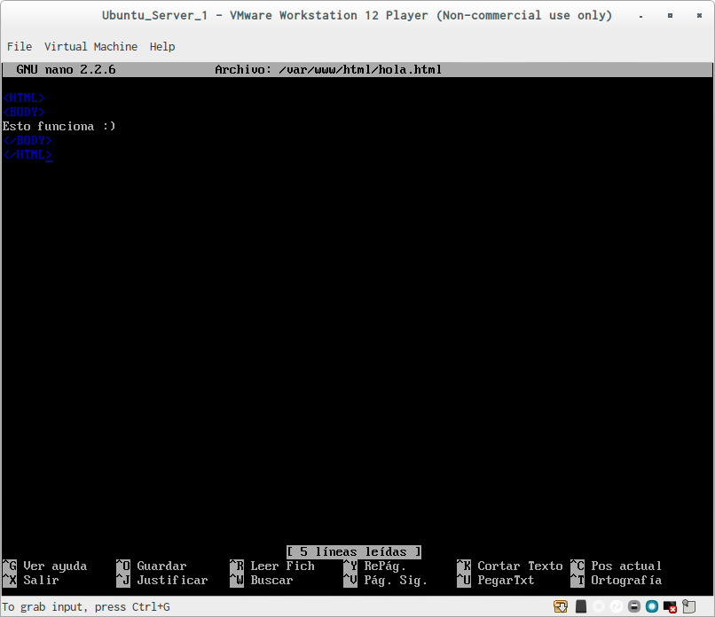

# Practica 1: Preparación de las Herramientas

En esta práctica vamos a proceder a la preparación de las herramientas a utilizar en las prácticas posteriores.

Para ello instalaremos dos máquinas virtuales Ubuntu Server 14.04, las cuales descargaremos de la página de [Ubuntu](http://www.ubuntu.com/download/server/thank-you?country=ES&version=14.04.4&architecture=amd64).

Una vez descargada creamos una máquina virtual y la instalamos, ya sea con VirtualBox o con VMWare.

En el proceso de instalación señalamos que instale en la máquina un servidor OpenSSH y un servidor LAMP.

Cuando terminamos el proceso de instalación definimos el password de root.
```
sudo passwd root
```

Para comprobar la versión de Apache que tenemos y si este está corriendo en nuestra máquina utilizamos
```
apache2 -v
ps aux | grep apache
```

El resultado que obtendremos es el siguiente:


Creamos en /var/www/html un archivo llamado hola.html
```
sudo touch /var/www/html/hola.html
sudo nano /var/www/html/hola.html
```
Dentro de dicho archivo escribimos el siguiente contenido:



Vamos a la otra máquina y obtenemos con cURL la página que hemos creado:
```
curl http://172.88.16.129/hola.html
```
Obtendremos el siguiente resultado:


Probamos a acceder también desde el navegador del host:


