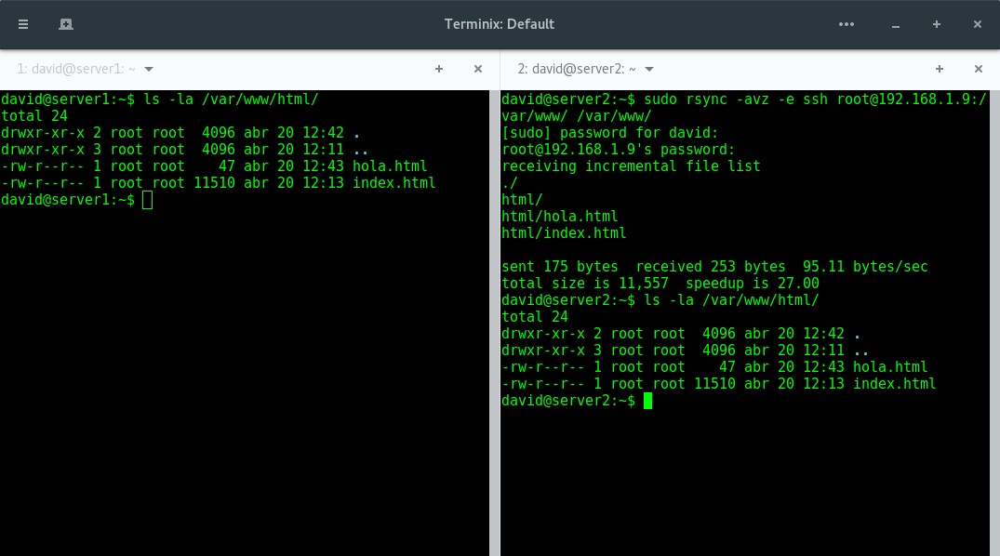
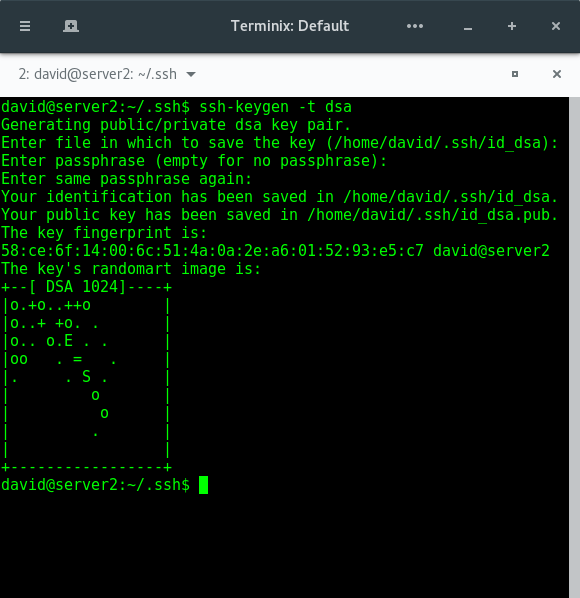
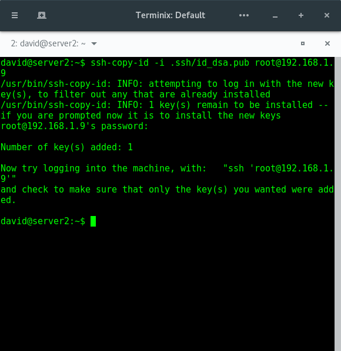
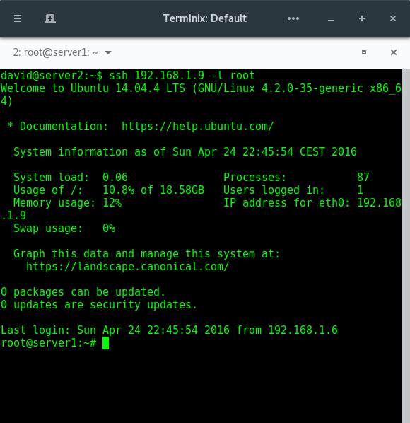
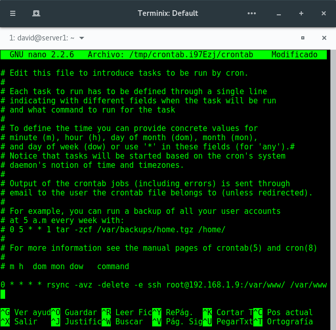

# Practica 2: Clonar información de un sitio web

En esta práctica vamos a aprender a copiar archivos mediante ssh, a clonar contenido entre máquinas y a establecer tareas con cron.

El primer paso es instalar la herramienta rsync mediante el siguiente comando:

```
sudo apt-get install rsync
```

A continuación tenemos que editar el archivo /etc/ssh/sshd_config y buscar la línea PermitRootLogin y ponerla de la siguiente manera:

```
PermitRootLogin yes
```

Una vez cumplidos estos requisitos ya podemos el contenido de la carpeta /var/www/ de la máquina server1 a la máquina server2 de la siguiente manera:
```
rsync -avz -e ssh root@ipserver1:/var/www/ /var/www/
```

Tras la ejecución de comprobamos con ls -la /var/www/html que ambas máquinas tienen el mismo contenido.



Para la automatización de esta tarea realizaremos un script que se conecte mediante ssh al equipo remoto para realizar la copia de los archivos. Para que no se esté solicitando la contraseña constantemente generaremos un par de claves pública-privada en el server2 y la copiamos en el server1 mediante la siguiente secuencia de comandos:

```
ssh-keygen -t dsa
```



```
ssh-copy-id -i .ssh/id_dsa.pub root@ipserver1
```



Ahora ya podemos acceder al server1 sin necesidad de introducir el password de esta.

```
ssh 192.168.1.9 -l root
```



Ahora programaremos una tarea con crontab para que se encargue de automatizar el proceso de copiado de /var/www/ de server1 a server2. Esto lo haremos de la siguiente manera:

```
sudo crontab -e
```

y añadimos la siguiente linea al archivo:

```
0 * * * * rsync -avz -delete -e ssh root@192.168.1.9:/var/www/ /var/www/
```


