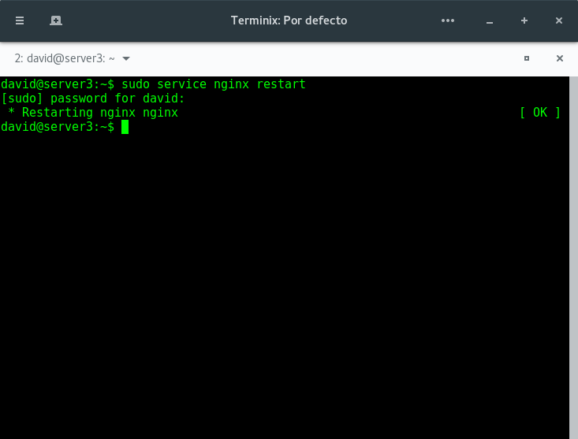

# Practica 3: Balanceo de carga

En esta práctica vamos a configurar una red entre varias máquinas para conseguir un balanceador HTTP que reparta la carga entre los servidores finales consiguiendo una infraestructura redundante y de alta disponibilidad.

Para ello instalaremos y configuraremos nginx (configurado como proxy) y haproxy. Dichas alternativas no pueden estar en funcionamiento en la misma máquina balanceadora a la vez.

## Instalación y configuración de nginx

Para la instalación y configuración de nginx debemos seguir los siguientes pasos:

1. Lo primero que debemos hacer es importar la clave del repositorio de software. Para ello utilizaremos los siguientes comandos:

   ```
   cd /tmp/
   wget http://nginx.org/keys/nginx_signing.key
   sudo apt-key add /tmp/nginx_signing.key
   rm -f /tmp/nginx_signing.key
   ```

   

2. A continuación añadimos el repositorio al fichero /etc/apt/sources.list ejecutando las siguientes órdenes en el terminal:

   ```
   echo "deb http://nginx.org/packages/ubuntu/ lucid nginx" >> /etc/apt/sources.list
   echo "deb-src http://nginx.org/packages/ubuntu/ lucid nginx" >> /etc/apt/sources.list
   ```

   

3. Actualizamos los repositorios y a continuación instalamos el paquete nginx

   ```
   sudo apt-get update
   sudo apt-get install nginx
   ```

   

4. Una vez instalado nginx procederemos a configurarlo como un balanceador de carga definiendo un balanceo mediante el algoritmo round-robin.
Para configurar el servidor nginx tenemos que modificar el fichero de configuración `/etc/nginx/conf.d/default.conf` eliminando su contenido para así crear la siguiente configuración:

   ```
   upstream apaches{
     server ip_servidor_1;
     server ip_servidor_2;
   }

   server{
     listen 80;
     server_name nombre_servidor_3;

     access_log /var/log/nginx/nombre_servidor_3.access.log;
     error_log /var/log/nginx/nombre_servidor_3.error.log;
     root /var/www/;
     location /
     {
       proxy_pass http://apaches;
       proxy_set_header Host $host;
       proxy_set_header X-Real-IP $remote_addr;
       proxy_set_header X-Forwarded-For $proxy_add_x_forwarded_for;
       proxy_http_version 1.1;
       proxy_set_header Connection "";
     }
   }
   ```

   

5. Reiniciamos el servdor nginx.

   ```
   sudo service nginx restart
   ```

   

6. Para probar que la nueva configuración funciona correctamente hacemos varias pruebas con `curl http://ip_balanceador` y este deberá de contestarnos alternamente con server1 y server2 como se muestra en el siguiente ejemplo:

   

7. Si alguna de las máquinas finales es más potente podemos modificar la definición del "upstream" para pasarles más tráfico que al resto de las del grupo utilizando el modificador "weight" al que le daremos un valor numérico que indica la carga que le asignamos (por defecto 1).

   En el siguiente ejemplo asignaremos más carga a la segunda máquina que a la primera:

   ```
   upstream apaches{
     server server1 weight=1;
     server server2 weight=2;
   }
   ```

   En el siguiente ejemplo podemos ver dicha configuración en funcionamiento:

   

8. Podemos utilizar la directiva `keepalive` para que se realice una conexión con una persistencia de múltiples peticiones HTTP en lugar de abrir una conexión nueva cada vez. Para ello modificaremos el upstream añadiendo keepalive y el tiempo de mantenimiento de la conexión en segundos:

   ```
   upstream apaches{
     server server1;
     server server2;
     keepalive 3;
   }
   ```

## Instalación y configuración de haproxy

Para la instalación y configuración de haproxy debemos seguir los siguientes pasos:

1. Lo primero que debemos hacer es instalar haproxy:

   ```
   sudo apt-get install haproxy
   ```

   

2. Modificamos el fichero de configuración de haproxy que se encuentra en la ruta `/etc/haproxy/haproxy.cfg` quedando este de la siguiente manera:

   ```
   global
     daemon
     maxconn 256

   defaults
     mode    http
     contimeout 4000
     clitimeout 42000
     srvtimeout 43000

   frontend http-in
      bind *:80
      default_backend servers

   backend servers
      server m1 server1:80 maxconn 32
      server m2 server2:80 maxconn 32
   ```

   

3. Lanzamos el servicio haproxy mediante el siguiente comando:

   ```
   /usr/sbin/haproxy -f /etc/haproxy/haproxy.cfg
   ```

4. Para probar que la nueva configuración funciona correctamente hacemos varias pruebas con `curl http://ip_balanceador` y este deberá de contestarnos alternamente con server1 y server2 como se muestra en el siguiente ejemplo:

   
