# Practica 4: Comprobaciones de Rendimiento

En esta práctica vamos a medir el rendimiento de los servidores creando una carga HTTP.

En nuestro caso vamos a utilizar Apache Benchmark y Siege.

## Notas iniciales:

Los servidores que vamos a probar son los configurados en la práctica anterior.

```
Servidor Web: 192.168.1.17
Servidor nginx: 192.168.1.20
Servidor haproxy: 192.168.1.21
```

Utilizaremos un script en php que genere carga en los servidores. El script es el siguiente:

```
<?php
  $tiempo_inicio = microtime(true);
  for ($i=0; $i<3000000; $i++){
    $a = $i * $i;
    $b = $a - $i;
    $c = $a / $b;
    $d = 1 / $c;
  }

  $tiempo_fin = microtime(true);
  echo "Tiempo empleado: " . round($tiempo_fin - $tiempo_inicio, 4) ;
?>
```

Todas los datos obtenidos están guardados en archivos adjuntos.

## Apache Benchmark:

Apache Benchmark es una utilidad que se instala junto con el servidor Apache y permite comprobar el rendimiento de cualquier servidor web. Para ello debemos ejecutar el siguiente comando:

```
ab -n 1000 -c 10 http://ip_del_servidor/test.php
```

Lanzarémos dicho comando varias veces para obtener varias mediciones. Para ello podemos lanzar un script con un bucle for que repita dichas mediciones sin necesidad de tener que lanzarlos manualmente.

Tras realizar estas pruebas en los tres servidores obtenemos los siguientes resultados:

```
for((i=0; i<6; i++));
do
  ab -n 1000 -c 10 http://192.168.1.17/test.php >> ServidorWeb.txt
done
```

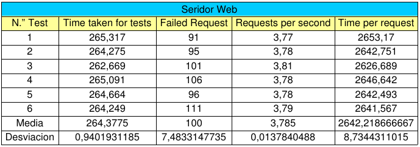

```
for((i=0; i<6; i++));
do
  ab -n 1000 -c 10 http://192.168.1.20/test.php >> ServidorNginx.txt
done
```

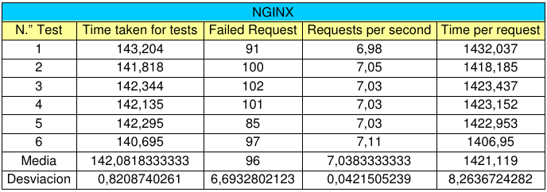

```
for((i=0; i<6; i++));
do
  ab -n 1000 -c 10 http://192.168.1.21/test.php >> ServidorHaproxy.txt
done
```

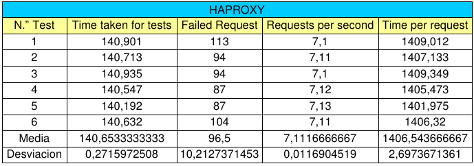

Ahora procedemos a la comparación de los datos obtenidos realizando las siguientes gráficas.

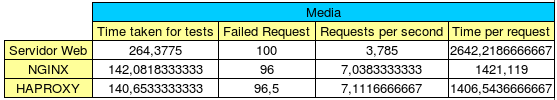

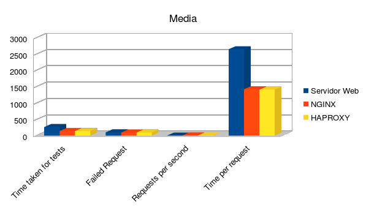

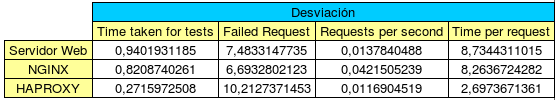

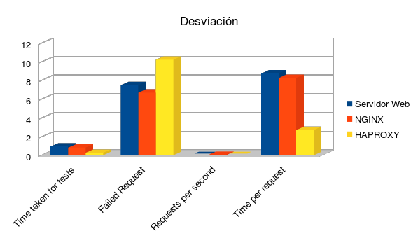

## Seige:

```
for((i=0; i<6; i++));
do
  siege -b -t60s -v http://192.168.1.17/test.php >> ServidorWeb.txt
done
```

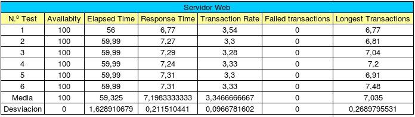

```
for((i=0; i<6; i++));
do
  siege -b -t60s -v http://192.168.1.20/test.php >> ServidorNginx.txt
done
```

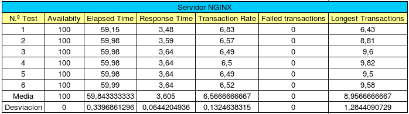

```
for((i=0; i<6; i++));
do
  siege -b -t60s -v http://192.168.1.21/test.php >> ServidorHaproxy.txt
done
```

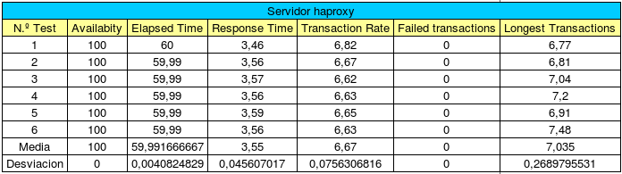

Tras realizar estas pruebas en los tres servidores obtenemos los siguientes resultados:

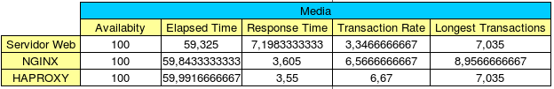

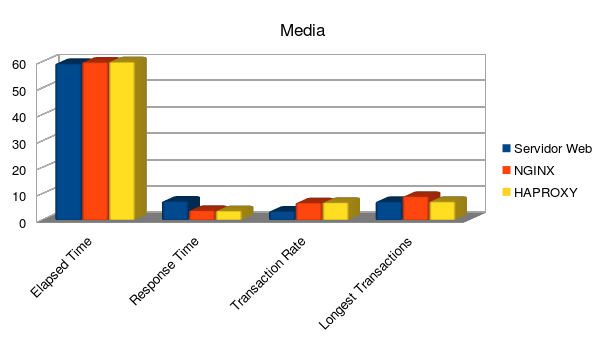

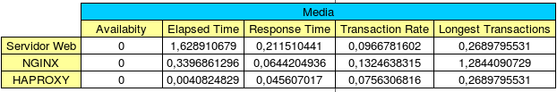

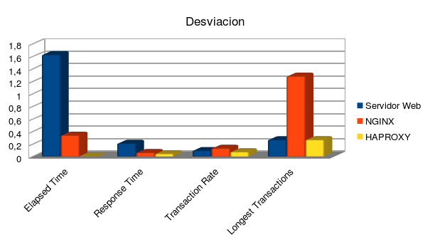
