# Práctica 5: Replicación de bases de datos MySQL

En esta práctica vamos a realizar copias de seguirdad de nuestros sistemas.

Los principales objetivos son:
* Copiar archivos de copia de seguridad mediante ssh.
* Clonar manualmente BD entre máquinas.
* Configurar la estructura maestro-esclavo entre dos máquinas para realizar el clonado automático de la información.

## Crear una BD e insertar datos

Vamos a crear una BD en MySQL en la que insertaremos algunos datos con los cuales realizaremos las copias de seguridad. Para ello usaremos la interfaz de linea de comandos de MySQL. Para acceder a dicha interfaz debemos introducir el siguiente comando:

```
mysql -uroot -p
```

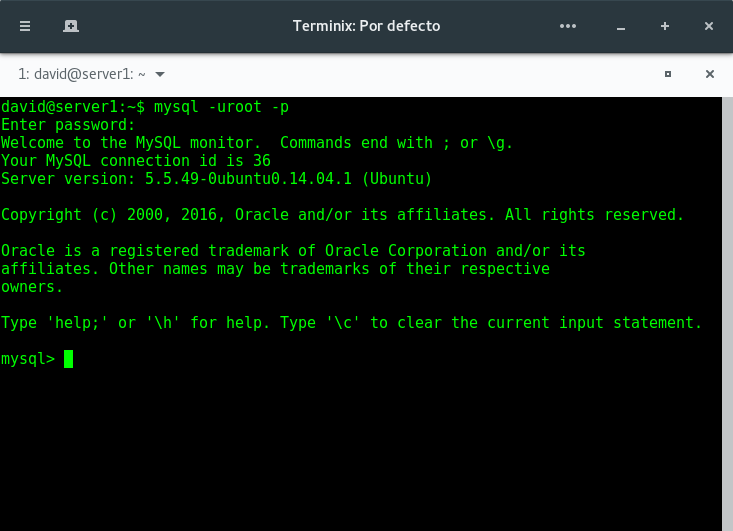

Una vez hemos tecleado la contraseña nos dispondremos a crear la BD y a introducir algunos datos en ella. Para esto seguiremos los siguientes pasos:

```
create database contactos;
use contactos;
show tables;
create table datos(nombre varchar(100), tlf int);
show tables;
insert into datos(nombre,tlf) values("pepe",95834987)
select * from datos;
```

Obtendremos una salida como esta:

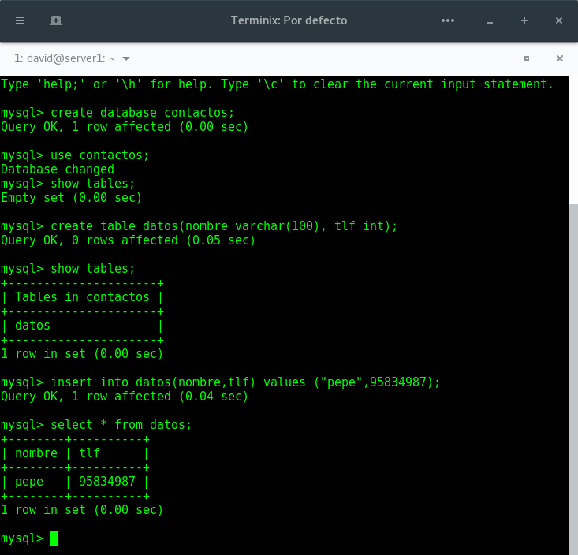

Ahora que ya tenemos datos en nuestra BD entraremos y haremos una consulta:

```
mysql -uroot -p
use contactos;
select * from datos;
describe datos;
quit
```

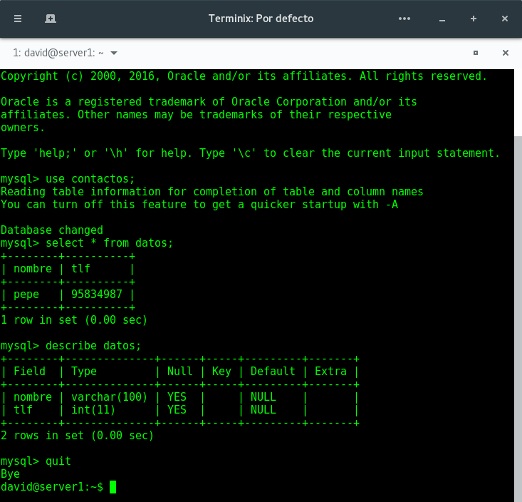

## Replicar una BD MySQL con mysqldump

MySQL ofrece una herramienta para clonar las BD que tenemos en nuestra máquina. Esta herramienta es mysqldump.

mysqldump puear
de ser utilizado para generar copias de seguridad de BD, para volcar una o varias BD para copia de seguridad o para transferir datos a otro servidor SQL. El volcado contiene comandos SQL para crear la BD, las tablas y rellenarlas.

Debemos tener en cuenta que los datos pueden estar actualizandose constantemente en el servidor de BD principal. En este caso, antes de hacer la copia de seguridad del archivo .SQL debemos evitar que se acceda a la BD para cambiar nada. Para ello vamos al servidor e introducimos la siguiente secuencia de comandos:

```
mysql -u root -p
FLUSH TABLES WITH READ LOCK;
quit
```

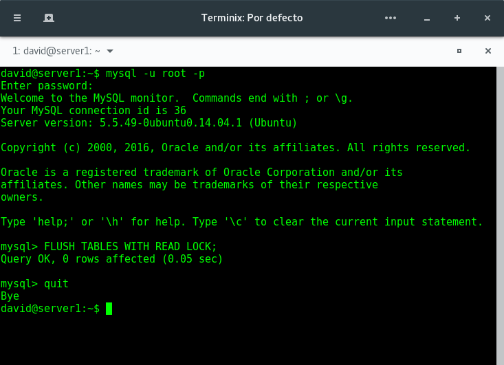

Una vez hemos bloqueado la escritura en la BD ya podemos realizar la réplica de nuestra BD en un fichero. Cuando la copia de la BD finalice procederemos al desbloqueo de esta.

```
mysqldump contactos -u root -p > /home/david/contactos.sql
mysql -u root -p
UNLOCK TABLES;
quit
```

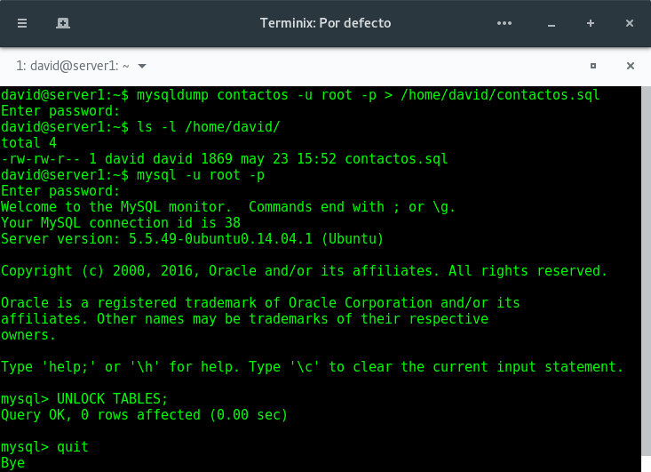

Ahora que tenemos la copia de la BD vamos a la segunda máquina  para copiar el archivo .sql que acabamos de crear en la primera máquina. Para ello ejecutamos el siguiente comando:

```
scp root@ip_maquina_uno:/home/david contactos.sql /home/david
```

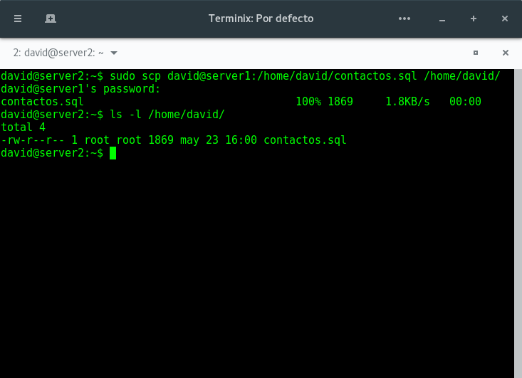

Con este archivode copia de seguridad en la máquina dos ya podemos importar la BD completa en MySQL. Para ello primero creamos la BD y luego restauramos los datos contenidos en la copia:

```
mysql -u root -p
create database contactos;
quit
mysql -u root -p contactos < /home/david/contactos.sql
```

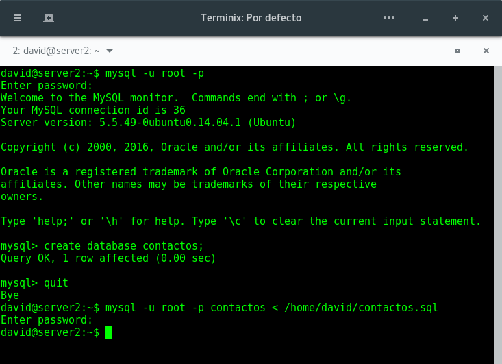

Con esto ya tenemos la copia de la BD funcionando en la máquina dos. Para comprobar que todo se ha restaurado correctamente realizamos unas consultas.

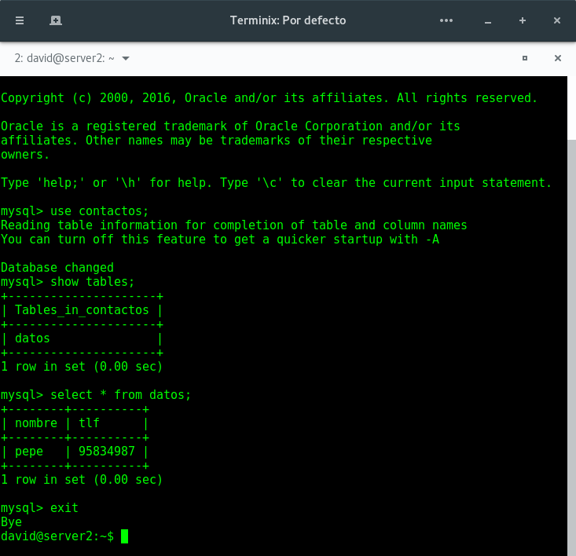

## Replicación de BD mediante una configuración maestro-esclavo

MySQL tiene la opcioón de configurar el demonio para hacer replicación de las BD sobre un esclavo a partir de los datos que almacena el maestro.

Este proceso es automático resulta muy adecuado en un entorno de producción real. Para ello vamos a configurar el servidor principal y el secundario.

* Partimos teniendo clonadas las bases de datos en ambas máquinas.

* Lo primero que debemos hacer es la configuración de mysql del maestro. Para ello editamos el archivo `/etc/mysql/my.cnf` y en el modificamos los siguientes parámetros:
   * Comentamos el parámetro `bind-adress 127.0.0.1`
   * Indicamos donde guardar el log de errores. `log_error = /var/log/mysql/error.log`
   * Establecemos el id del servidor `server-id = 1`
   * Indicamos donde guardar el registro binario. `log_bin = /var/log/mysql/bin.log`
* Una vez realizados estos pasos guardamos el documento y reiniciamos el servicio con `/etc/init.d/mysql restart`

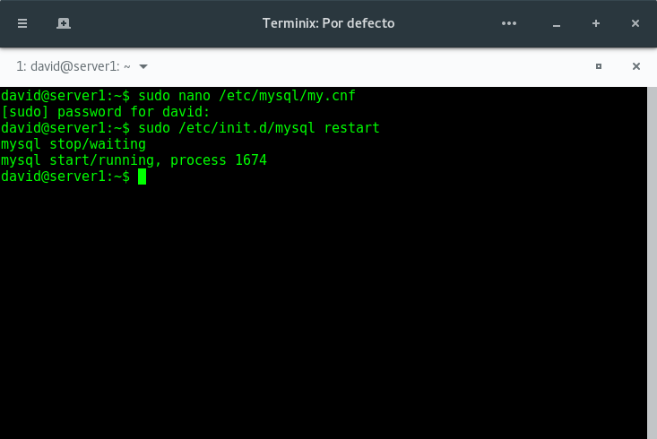

Con esto ya tenemos lista la configuración del maestro y podemos pasar a editar el esclavo. Para ello editamos los mismos parámetros que hemos modificado en el servidor maestro pero esta vez indicamos que el `server-id = 2`. Si la versión de MySQL es inferior a la 5.5 debemos configurar en el esclavo los datos del maestro (En mi caso tengo instalada la versión 5.5.49 por lo que no es necesario). Una vez editado el fichero guardamos la configuración y reiniciamos el servicio en el esclavo.

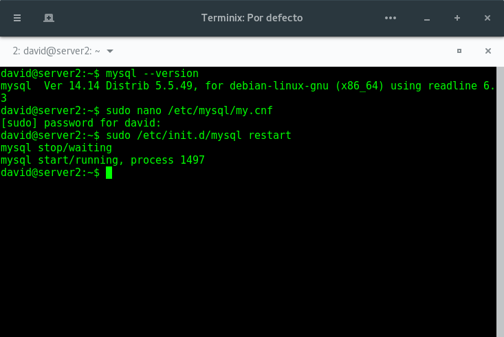

Ahora podemos volver al maestro para crear un usuario y darle permisos de acceso para la replicación. Entramos en mysql y ejecutamos las siguientes sentencias:

```
mysql -u root -p
CREATE USER esclavo IDENTIFIED BY 'esclavo';
GRANT REPLICATION SLAVE ON *.* TO 'esclavo'@'%' IDENTIFIED BY 'esclavo';
FLUSH PRIVILEGES;
FLUSH TABLES;
FLUSH TABLES WITH READ LOCK;
SHOW MASTER STATUS;
```

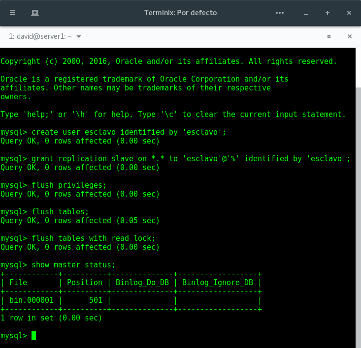

Ahora volvemos al esclavo e introducimos los datos del maestro.

```
mysql -u root -p
change master to master_host="ip_server_1", master_user='esclavo', master_password='esclavo', master_log_file = 'mysql-bin.000001', master_log_pos = 501, master_port = 3306;

start slave;
unlock tables;
```

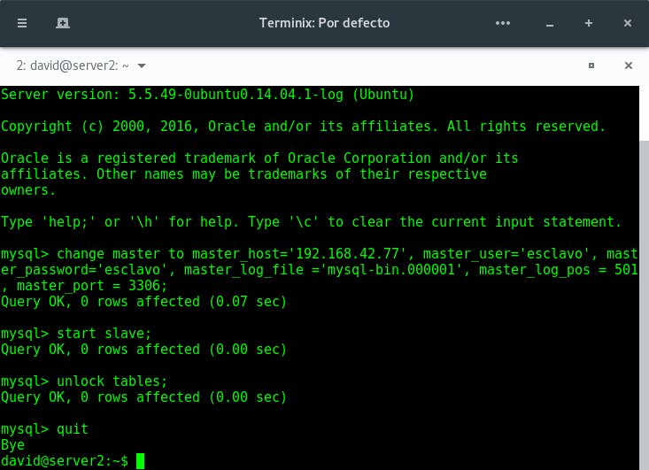

Para comprobar que todo funciona correctamente en el esclavo ejecutamos `show slave status\G` y comprobamos que el campo `second_behind_master` es distinto de null.

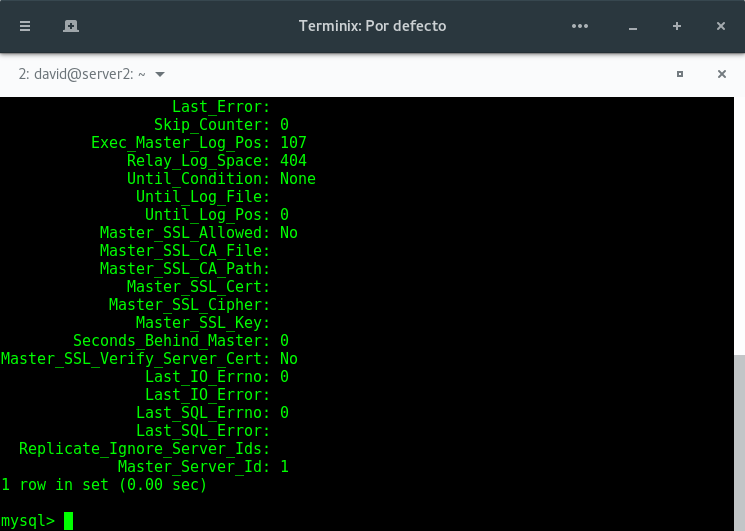

Con esto hemos terminado la configuración de nuestro maestro-esclavo.
