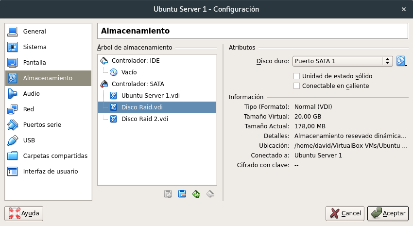
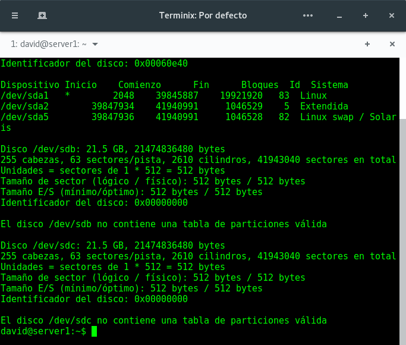
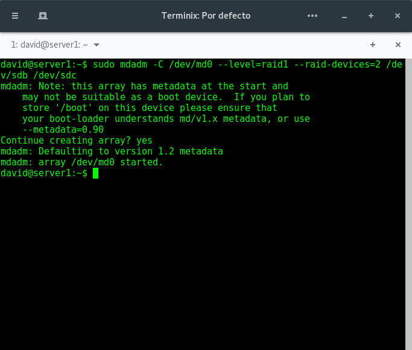
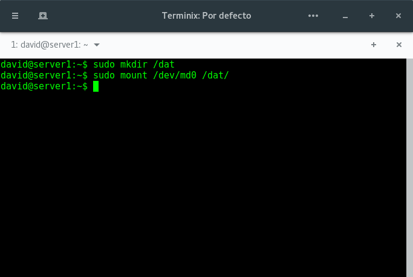
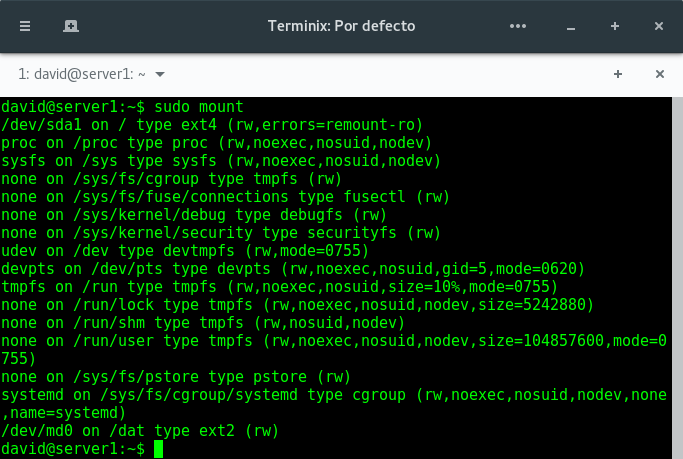
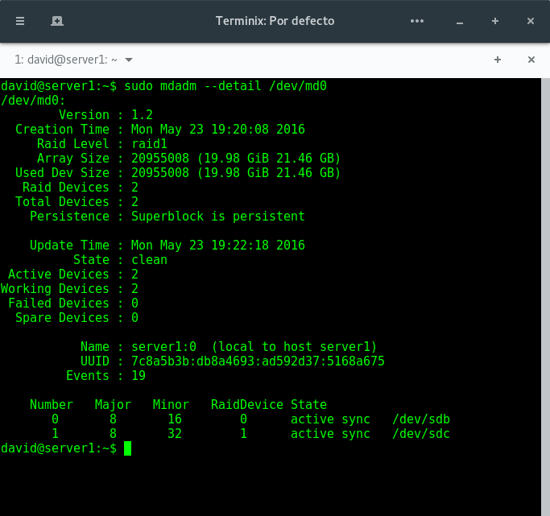
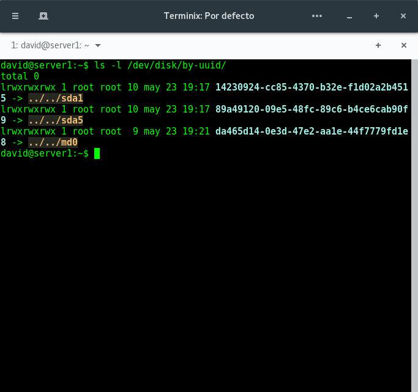
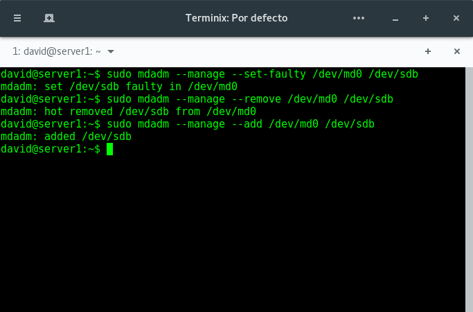

# Práctica 6: Discos en RAID

En esta práctica vamos a configurar dos discos en RAID 1 por software usando una de las máquinas virtuales que tenemos instaladas. Esta configuración RAID ofrece una gran seguridad al replicar los datos en los dos discos.

## Configuración del RAID por software

Partiremos de una máquina virtual ya instalada y configurada a la que añadiremos estando apagada dos discos del mismo tipo y capacidad.



A continuación arrancamos la máquina e instalamos el software necesario para configurar el RAID y buscamos la información de los dos discos que acabamos de añadir:

```
sudo apt-get install mdadm
sudo fdisk -l
```



Realizados estos pasos ya podemos crear el RAID 1 usando el dispositivo `/dev/md0`, indicando el número de dispositivos a utilizar así como su ubicación:

```
sudo mdadm -C /dev/md0 --level=raid1 --raid-devices=2 /dev/sdb /dev/sdc
```



Ahora procederemos a darle formato al dispositivo RAID:
```
sudo mkfs /dev/md0
```

Ya podemos crear el directorio en el que se montará la unidad del RAID:

```
sudo mkdir /dat
sudo mkdir /dev/md0 /dat
```



Montamos el dismositivo para comprobar que todo se ha realizado correctamente:

```
sudo mount
```



Comprobamos el estado del RAID:

```
sudo mdadm --detail /dev/md0
```



Configuramos el sistema para que monte el dispositivo RAID creado al arrancar el sistema. Primero debemos obtener el UUID del dispositivo ejecutando la orden:

```
ls -l /dev/disk/by-uuid/
```



Una vez tenemos el UUID del dispositivo editamos el archivo `/dev/fstab` y añadimos la siguiente linea:

```
UUID = UUID_de_nuestro_dispositivo /dat ext2 defaiñts 0 0
```

y con esto conseguimos que el dispositivo RAID se monte automáticamente al iniciar el sistema.

Finalmente para probar el funcionamiento del dispositivo RAID simularemos un fallo en uno de los discos, lo retiraremos en caliente y lo volveremos a añadir en caliente:

```
sudo mdadm --manage --set-faulty /dev/md0 /dev/sdb
sudo mdadm --manage --remove /dev/md0 /dev/sdb
sudo mdadm --manage --ad /dev/md0 /dev/sdb
```


